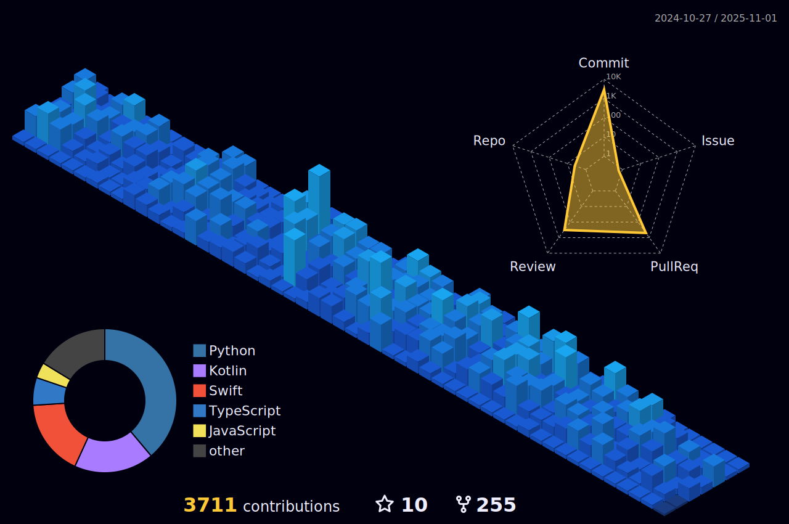

# Hello! I'm Jeongin Lee
* Live in Ansan, South Korea
* Graduated student majored in computiung science in Hanyang Univ. ERICA Campus
* Master Student majored in aritificial intelligence in Hanyang Univ.

## Main Project
* HYUabot
  * Campus information system for Hanyang Univ. (2017~)
  * Provide a lot of information about campus
    * Shuttle Bus Timetable
    * Bus Timetable
    * Subway arrival information (Hanyang Univ at Ansan)
    * Cafeteria menu
    * Reading room seats
    * Academic calendar
    * Others
  * Components
    * API Backend
      * [hyuabot-backend-python](https://github.com/hyuabot-developers/hyuabot-backend-python)
      * [hyuabot-backend-rust](https://github.com/hyuabot-developers/hyuabot-backend-rust) - Deprecated
    * Kakaotalk Chat Backend
      * [hyuabot-kakao-backend-python](https://github.com/hyuabot-developers/hyuabot-kakao-backend-python)
    * Frontend
      * [hyuabot-client-pwa](https://github.com/hyuabot-developers/hyuabot-client-pwa) - Deprecated
      * [hyuabot-client-web-angular](https://github.com/hyuabot-developers/hyuabot-client-web-angular) - Deprecated
      * [hyuabot-client-web-vuejs](https://github.com/hyuabot-developers/hyuabot-client-web-vuejs) - Deprecated
    * Android App
      * [hyuabot-client-android](https://github.com/hyuabot-developers/hyuabot-client-android)
    * iOS App
      * [hyuabot-client-ios](https://github.com/hyuabot-developers/hyuabot-client-ios)
    * Infrastructure
      * [hyuabot-infrastructure](https://github.com/hyuabot-developers/hyuabot-infrastructure)

## News
* [News H Article](https://www.newshyu.com/news/articleView.html?idxno=945543)
* [VOH Interview](https://www.youtube.com/watch?v=oscf4rpIjYo)
* [한대신문](https://www.hynews.ac.kr/news/articleView.html?idxno=12631)

## Social

## Language

## Framework

## Database

## CI/CD

## Infrastructure

## Contributions

## My farm
